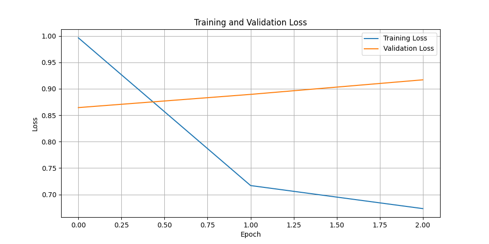
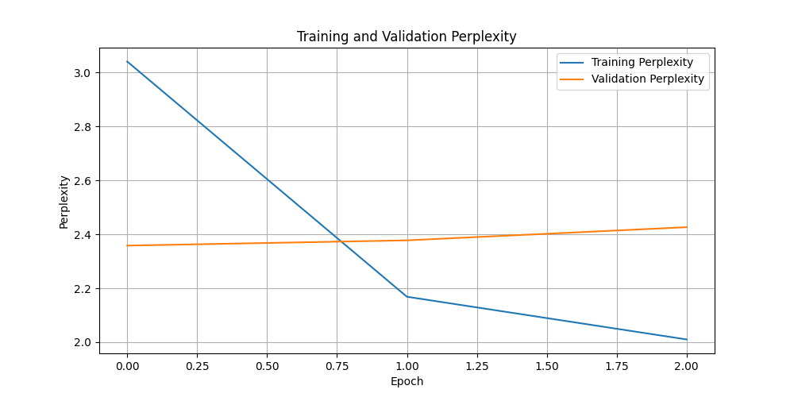
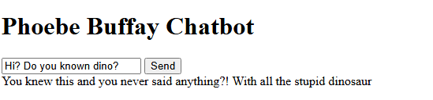

# Phoebe Buffay Chatbot

## Описание
Чат-бот, имитирующий манеру речи персонажа Фиби Буффе из сериала "Друзья". Бот использует генеративный подход на основе модели GPT-2. Для улучшения качества ответов применяются следующие методы:
- **Контекстное окно**: Сохранение истории диалога для генерации более связных ответов.
- **Фильтрация ответов**: Проверка ответов на наличие ключевых слов.
- **Постобработка**: Исправление грамматики и удаление повторений.
- **Ранжирование ответов**: Генерация нескольких вариантов и выбор лучшего.

## Данные
Используются данные из цитат Фиби Буффе ("https://fangj.github.io/friends/season/"), содержащие реплики из сериала "Друзья". Данные были предварительно очищены и подготовлены для обучения.

## Инструкция по запуску

### Установка зависимостей
pip install -r requirements.txt
### Скачивание и предобработка данных
python download.py
### Обучение модели
model\train.ipynb
### Запуск веб-сервиса
uvicorn app:app --reload
### Использование
Сделайте POST-запрос:
POST http://localhost:8000/chat/
### С JSON-телом:
{
  "query": "Hey Phoebe, sing a song?"
}
### Или откройте HTML-интерфейс в браузере:
open index.html

## Архитектура
Генеративный бот на основе модели GPT-2. Для улучшения качества ответов применяются следующие методы:
- **Контекстное окно**: Сохранение истории диалога для генерации более связных ответов.
- **Фильтрация ответов**: Проверка ответов на наличие ключевых слов.
- **Постобработка**: Исправление грамматики и удаление повторений.
- **Ранжирование ответов**: Генерация нескольких вариантов и выбор лучшего.

## Обучение
Ход обучения описан в model\train.ipynb
К сожалению, переобучение побороть не получилось

1. **Модель**: GPT-2 с добавлением специальных токенов (`<START>`, `<END>`).
2. **Гиперпараметры**:
   - Количество эпох: 3
   - Размер батча: 8
   - Скорость обучения: 5e-5
   - Регуляризация: 0.01
3. **Метрики**:
   - Training Loss: 0.6893
   - Validation Loss: 0.8944

### Предобработка данных
- Удаление пустых строк и слишком коротких реплик.
- Токенизация и создание эмбеддингов для GPT-2.
- Разделение данных на обучающую и тестовую выборки.

### Графики обучения

## Пример работы веб-сервиса

